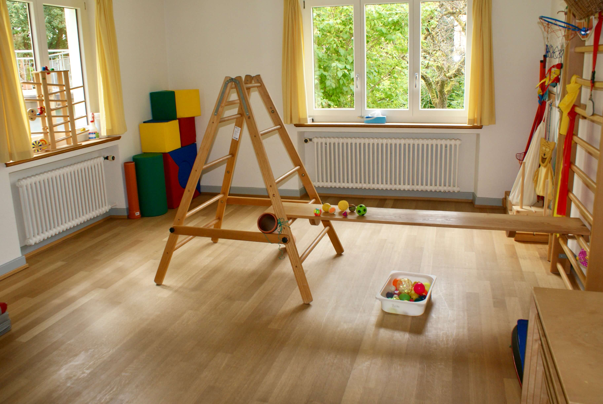

---
hide:
  - toc
---

# Kinderphysiotherapie {: .kprh_hero_title}

## Angebot 

In der Praxis arbeite ich mit Frühgeborenen, Säuglingen, Kindern und Jugendlichen mit sensomotorischen Auffälligkeiten, mit Entwicklungsverzögerungen und komplexen Mehrfachbehinderungen. Ich behandle Asymmetrien und Haltungsauffälligkeiten, orthopädische Probleme, Schmerzen und Verletzungen am Bewegungsapparat. 

Ich bin spezialisiert auf Abklärungen und Anpassungen von Hilfsmitteln in Zusammenarbeit mit Orthopädietechnikern. 
  
Falls vom Arzt verordnet, behandle ich Ihr Kind gerne auch bei Ihnen zuhause.

## Kostenübernahme

In der Regel wird die Physiotherapie vom Arzt verordnet. Die Kosten für die Behandlung übernimmt die Krankenkasse (KK) oder die Invalidenversicherung (IV). 

Abmeldungen müssen bis spätestens 24 Stunden vor dem Termin erfolgen, ansonsten muss ich die Behandlungen privat in Rechnung stellen. 

### Tarife im Kanton Zürich

| Tarif                                                                     | KK        | IV        |
| ------------------------------------------------------------------------- | --------- | --------- |
| Sitzungspauschale allgemeine Physiotherapie                               | CHF 53.28 |           |
| Sitzungspauschale aufwändige Bewegungstherapie                            | CHF 85.47 | CHF 77.-- | 
| Zuschlagsposition für Behandlung chronisch behinderter Kinder bis 6 Jahre | CHF 33.30 | CHF 30.-- |
| Zuschlagposition für Weg- und Zeitentschädigung                           |           | CHF 34.-- |

## Praxisgemeinschaft

In der Praxis erhalten Sie weitere Angebote: 

[Kinderphysiotherapie bei Barbara Graf](http://kinder-physiotherapie.ch) 
[Craniosacraltherapie bei Barbara Graf](http://craniosacral-winterthur.ch) 
[Ernährungsberatung bei Susanne Sigrist](https://ernaehrungsberatungwinterthur.ch/) 

