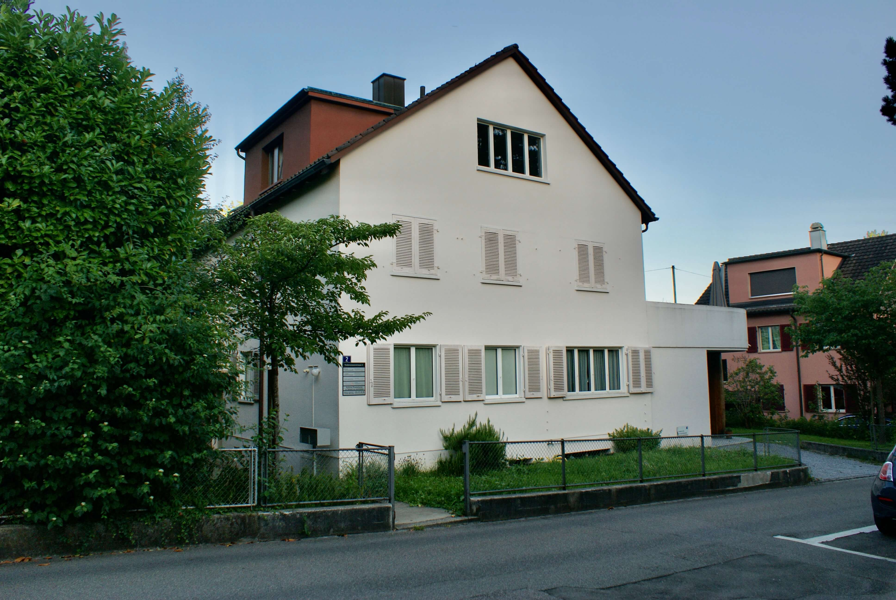

---
hide:
  - toc
---

# Kontakt {: .kprh_hero_title}

Kinderphysiotherapie Rita Hensler 
[Trottenwiesenstrasse 2](https://www.google.ch/maps/place/Kinderphysiotherapie+Rita+Hensler/@47.50262,8.7453224,17z/data=!4m15!1m8!3m7!1s0x479a9947f8972f45:0x370928b29aa906a!2sKinderphysiotherapie+Rita+Hensler!8m2!3d47.50262!4d8.7479027!10e1!16s%2Fg%2F11v9yvg48m!3m5!1s0x479a9947f8972f45:0x370928b29aa906a!8m2!3d47.50262!4d8.7479027!16s%2Fg%2F11v9yvg48m?entry=ttu) 
8404 Winterthur 

Telefon: 077 435 58 82 
Mail: <!-- fhetydagzzzgjds --> rita....hensler@<!-- sdfjsdhfkjypcs -->physio-hin<!-- asjoxp -->....ch

Die Praxis ist  nicht rollstuhlgängig. Kinderwagen und Rollstühle können im Eingang parkiert werden, fünf Treppenstufen führen zu den Praxisräumen. 

## Praxisgemeinschaft

In der Praxis erhalten Sie weitere Angebote: 

[Kinderphysiotherapie bei Barbara Graf](http://kinder-physiotherapie.ch) 
[Craniosacraltherapie bei Barbara Graf](http://craniosacral-winterthur.ch) 
[Ernährungsberatung bei Susanne Sigrist](https://ernaehrungsberatungwinterthur.ch/) 

