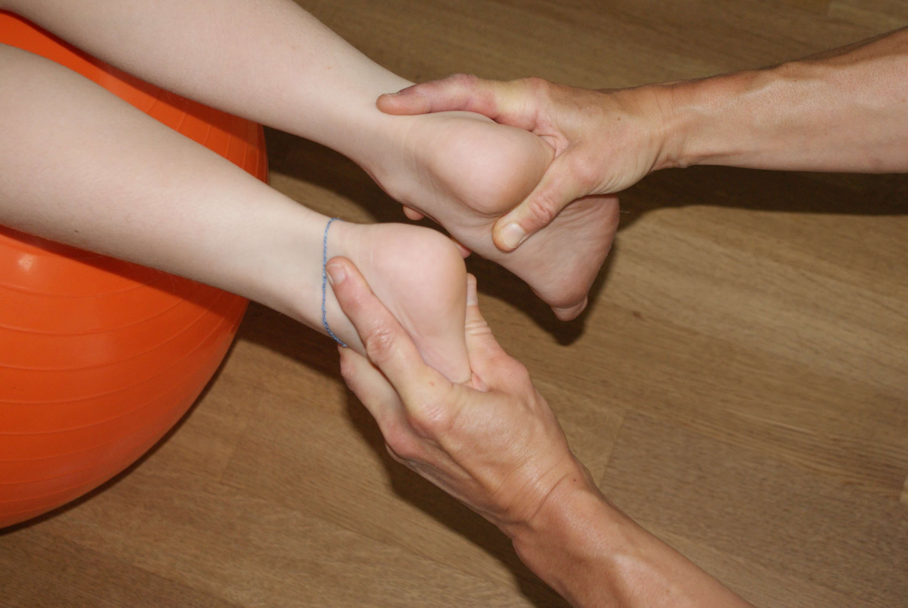

---
hide:
  - toc
---

# Kostenübernahme {: .kprh_hero_title}

In der Regel wird die Physiotherapie vom Arzt verordnet. Die Kosten für die Behandlung übernimmt die Krankenkasse (KK) oder die Invalidenversicherung (IV). 

Abmeldungen müssen bis spätestens 24 Stunden vor dem Termin erfolgen, ansonsten muss ich die Behandlungen privat in Rechnung stellen. 

## Tarife im Kanton Zürich

| Tarif                                                                     | KK        | IV        |
| ------------------------------------------------------------------------- | --------- | --------- |
| Sitzungspauschale allgemeine Physiotherapie                               | CHF 53.28 |           |
| Sitzungspauschale aufwändige Bewegungstherapie                            | CHF 85.47 | CHF 77.-- | 
| Zuschlagsposition für Behandlung chronisch behinderter Kinder bis 6 Jahre | CHF 33.30 | CHF 30.-- |
| Zuschlagposition für Weg- und Zeitentschädigung                           |           | CHF 34.-- |
