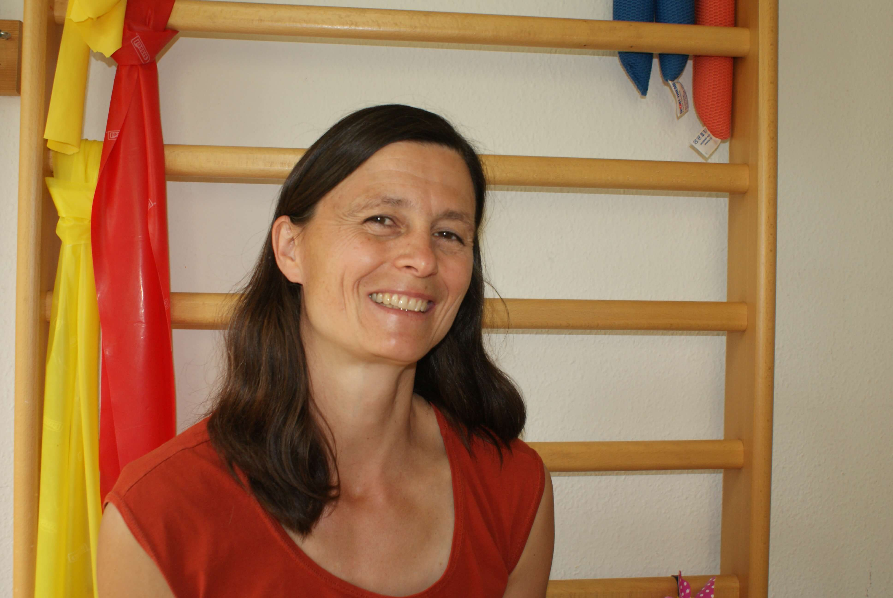

---
hide:
  - toc
  - footer
---

# Über mich {: .kprh_hero_title}

Rita Hensler 
Dipl. Physiotherapie FH für Säuglinge, Kinder und Jugendliche

Mir sind die ganzheitliche Behandlung und die gegenseitige Wertschätzung sehr wichtig. Gerne gehe ich auf die individuellen Bedürfnisse der Kinder und deren Familien ein. Gemeinsam suche ich nach Lösungen, welche im Alltag umsetzbar sind. Als Mutter von drei Kindern kenne ich die Herausforderungen, welche der Familienalltag mit sich bringt.

## Ausbildung, Beruflicher Werdegang

|             |    |
| ----------- | -- |
| Ab 2023     | Selbständige Tätigkeit als Kinderpyhsiotherapeutin in Winterthur |
| 2018 - 2023 | Maurerschule, Schule für Kinder und Jugendliche mit Autismus und Körper- und Mehrfachbehinderungen, Winterthur |
| 2007 - 2018 | Schule für Kinder und Jugendliche mit Körper- und Mehrfachbehinderungen, Zürich |
| 2006 - 2007 | Physiotherapie Eckstein, Fahrwangen |
| 2005        | Stellvertretung Physiotherapie Glarus |
| 2005        | Diplom als Physiotherapeutin |

## Weiterbildungen 

|             |    |
| ----------- | -- |
| 2019 - 2023 | Verschiedene Seminare zum Thema Autismus |
| 2022 - 2023 | Viszerofasciale Ostheopathie |
| 2021 - 2022 | Craniosacrale Ostheopathie |
| 2019 - 2020 | Manuelle osteopathische Therapie für Kinder |
| 2017        | Sensorische Integration - Aufbaukurs Modul 4, Kinder mit Mehrfachdiagnosen |
| 2016        | Gebärden nach Anita Portmann |
| 2015        | Galileo, Workshop Vibrationstraining in der Pädiatrie |
| 2014        | Gehen verstehen, Grund- und Aufbaukurs in der Pädiatrie |
| 2012 - 2013 | Sensorische Integration, Grundkurs |
| 2008 - 2009 | Kinderbobathkurs, Lebenswege Berlin |
| 2008        | Kinästhetics Grundkurs |
| 2008        | Ergonomie, Sitzen und Rollstuhlversorgung unter der Leitung von Bengt Engström |
| 2008        | GMFM (Gross Motor Function Measure) |
| 2007        | Muscle Balance LWS |

## Mitgliedschaften 

[Physioswiss](https://www.physioswiss.ch) 
[Physiopaed](https://www.physiopaed.ch) 
Kinderbobath-Qualitätszirkel 
[Autismus Deutsche Schweiz](https://www.autismus.ch/)
